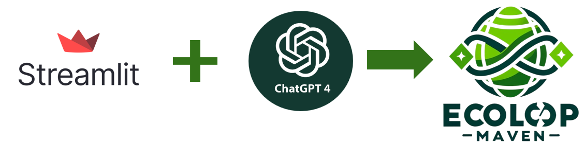

# Ecoloop Maven

This is the Github Repo of the Team SustainEarth for the AI EarthHack Competition 2024. The project includes a Streamlit application that allows users to evaluate their business ideas by uploading a CSV file or by entering the ideas manually. The CSV file should contain three columns: ID, Problem, and Solution. The application uses the GPT-4 Turbo model to evaluate each idea and displays the result on the Streamlit app.




## Product Overview

Ecoloop Maven is a powerful tool designed to help entrepreneurs and innovators evaluate their business ideas in the context of sustainability. The application leverages the capabilities of the GPT-4 model, a state-of-the-art language model developed by OpenAI, to analyze and evaluate the potential impact and viability of business ideas.

Users can upload a CSV file containing their business ideas. Each idea should be represented by a row in the CSV file, with three columns: ID, Problem, and Solution. The 'Problem' column should describe a sustainability issue that the business idea aims to address, and the 'Solution' column should detail how the business idea plans to solve this issue.

Once the CSV file is uploaded, Ecoloop Maven processes each idea, using the GPT-4 model to evaluate the potential impact and viability of the proposed solution. The results are then displayed on the Streamlit application, providing users with valuable insights into their business ideas.

Whether you're an entrepreneur looking for feedback on your latest idea, an investor seeking to evaluate potential investment opportunities, or a sustainability enthusiast interested in exploring innovative solutions to environmental issues, Ecoloop Maven offers a unique and powerful tool to aid in your endeavors.

## Project Structure

The project consists of two main Python files:

- `main.py`: This is the main script that runs the Streamlit application. It handles the user interface and the file upload functionality.

- `prompt.py`: This script contains the function to evaluate business ideas using the GPT-4 model.

## Setup and Installation

Follow these steps to set up and run the project:

1. Clone the repository:
    ```bash
    git clone https://github.com/offcial17/SustainEarth
    cd SustainEarth
    ```

2. Install the required dependencies:
    ```bash
    pip install -r requirements.txt
    ```

3. Run the Streamlit application:
    ```bash
    streamlit run main.py
    ```


### Replace the API key in the .env file

Go to file named `.env` and add your `OPENAI_API_KEY` to it.

## Usage

To use the application, follow these steps:

1. Run the Streamlit application.
2. Upload a CSV file with the following format: ID, Problem, Solution.
3. The application will evaluate each idea and display the result.

## Contributing

Contributions are welcome! Please feel free to submit a Pull Request.
